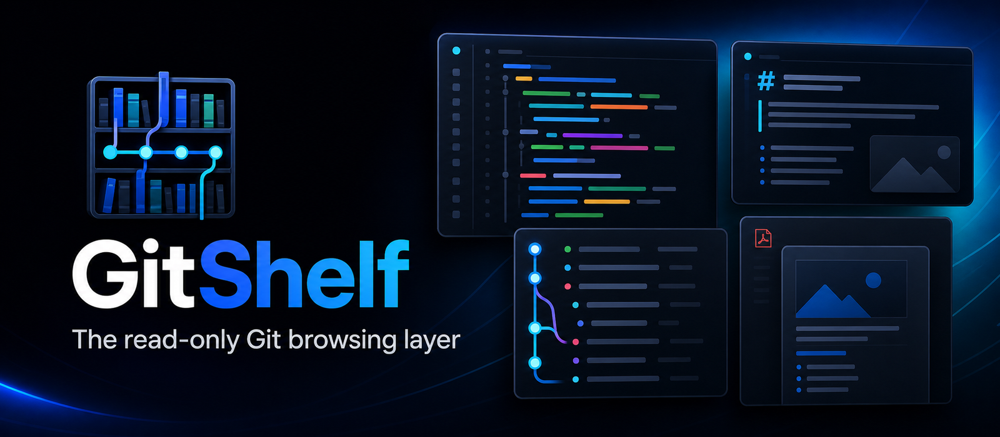
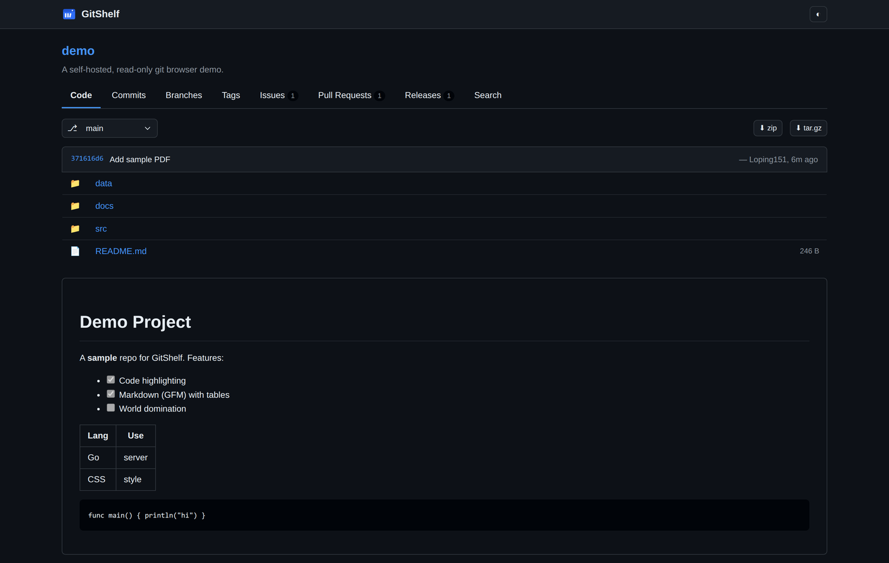
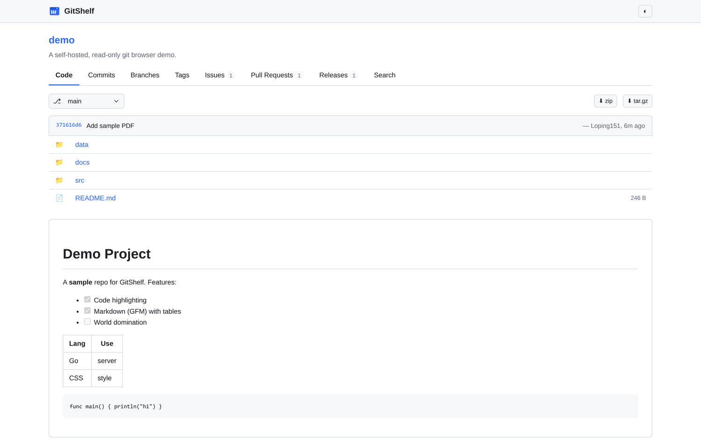
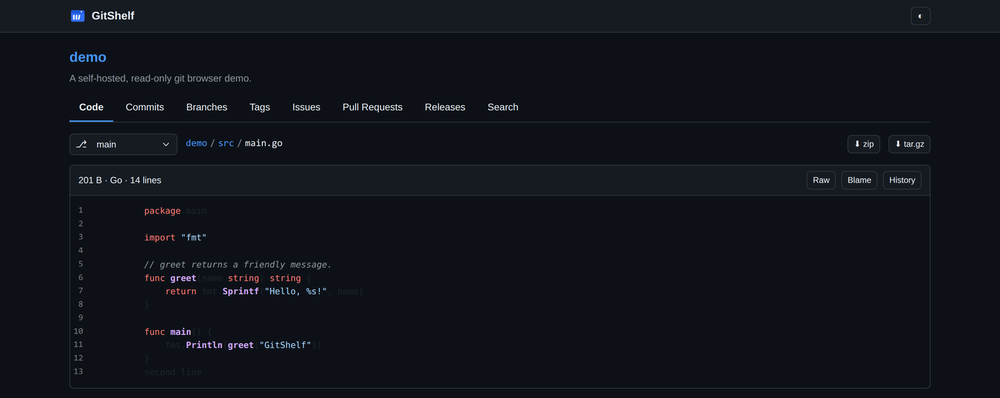
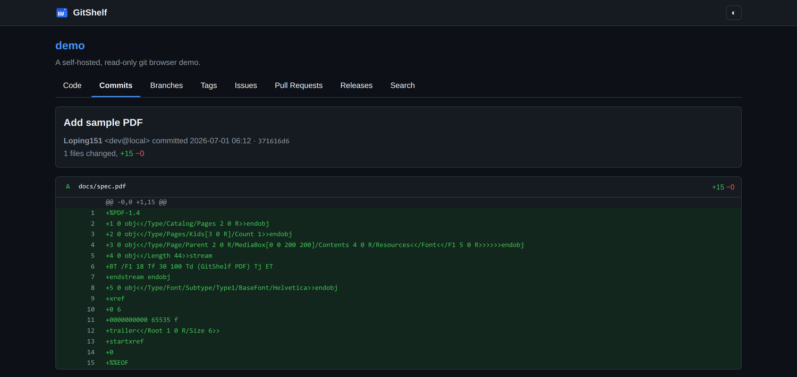
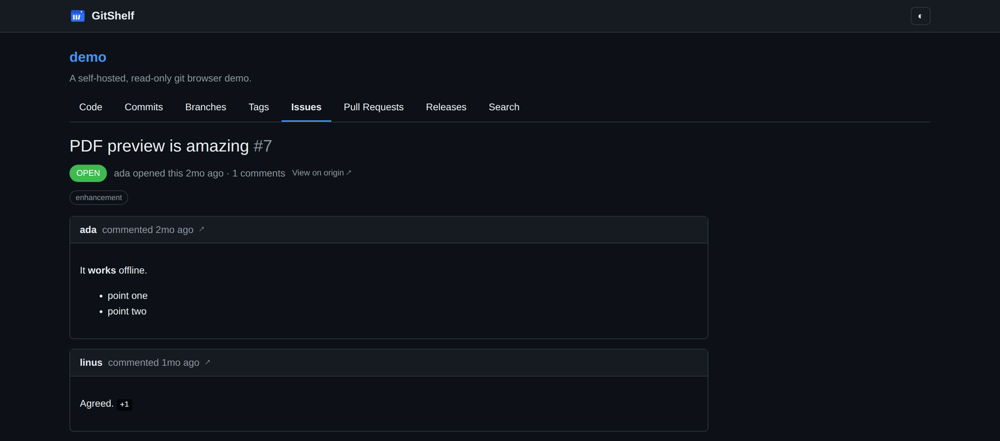
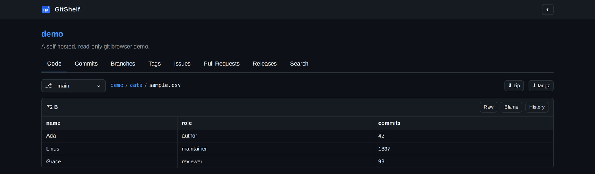

<div align="center">


# GitShelf

[English](README.md) · **简体中文**

自托管的只读 Git 浏览器。指向一个放裸库/镜像库的目录，就能像 GitHub 一样浏览，不导入、不拷贝。



[功能](#功能) · [快速开始](#快速开始) · [配置](#配置) · [截图](#截图)

</div>

典型用法：离线浏览每晚的 **GitHub 镜像备份**（`git clone --mirror`）。

GitShelf 就地读取已有的 `*.git` 镜像，给你目录树、富文件预览（代码、Markdown、PDF、
图片、音视频、CSV、JSON）、提交历史与 diff、blame、代码搜索；如果你导出了元数据，还能把
issues、PR、release 和代码放在一起看。它刻意只做只读：不推送、不跑 CI、不编辑 issue，
只做浏览层。

## 为什么

cgit 太简陋；Gitea、GitLab 又重，而且坚持先把仓库导入自己的存储。GitShelf 卡在中间——
直接读磁盘上已有的东西。

| | Gitea / Forgejo | cgit | GitLab CE | GitShelf |
|---|---|---|---|---|
| 就地读已有裸库 | 需导入 | 是 | 需导入 | **是** |
| 文件预览（代码 / PDF / 图片…） | 不错 | 很弱 | 很好 | **不错** |
| 展示导出的 issues / PR | 否 | 否 | 否 | **是** |
| 资源占用 | 低 | 极低 | 重 | **单二进制** |
| 定位 | 全功能 forge | 极简 | 全功能 forge | **只读** |

## 功能

- 直接读你已有的裸库 / 镜像库——不导入、不复制。
- 文件预览：语法高亮（Chroma）、GitHub 风格 Markdown、图片、PDF、音视频、CSV/TSV、JSON，渲染器可插件化。
- 分支 / 标签切换、提交历史、diff、compare、blame、`git grep` 搜索、zip/tar.gz 下载。
- 可选：从导出的 JSON 读取 issues / PR / release，与代码并排展示。
- 鉴权默认开启——首次访问引导你创建管理员账户。
- 明 / 暗 / 跟随系统主题，响应式，键盘友好。
- 单个静态二进制，配置驱动，默认绑定 `127.0.0.1`，无需数据库。

## 快速开始

需要 Go 1.26+ 和 PATH 里的 `git`。

```bash
go build -o gitshelf ./cmd/gitshelf
cp gitshelf.example.toml gitshelf.toml   # 然后改 repo_source.path
./gitshelf -config gitshelf.toml         # http://127.0.0.1:8888
```

不想自己编译？直接到 [Releases](https://github.com/Loping151/GitShelf/releases) 下载对应平台的预编译二进制。

或用 Docker：

```bash
docker run -p 8888:8888 \
  -v /path/to/mirrors:/mirrors:ro \
  -v /path/to/gitshelf.toml:/etc/gitshelf.toml:ro \
  ghcr.io/loping151/gitshelf
```

仓库源就是一个放裸库的目录：

```
/path/to/mirrors/
  project-a.git/      # 来自：git clone --mirror <url>
  project-b.git/
```

## 配置

一个 TOML 文件驱动一切，没有任何硬编码路径。完整说明见
[`gitshelf.example.toml`](gitshelf.example.toml)。

```toml
[server]
bind = "127.0.0.1:8888"   # 改成 0.0.0.0:8888 暴露到局域网
theme = "auto"

[[repo_source]]
path = "/path/to/mirrors"
glob = "*.git"
namespace = "flat"        # flat: /<repo>   owner: /<owner>/<repo>

[metadata]                # 可选
provider = "json-export"
path = "/path/to/meta"

[auth]
enabled = true            # 首次访问创建管理员账户
```

**鉴权**默认开启。首次启动会跳转到一次性的 `/setup` 页面，让你设置管理员用户名和密码
（以 bcrypt 哈希存储，绝不写进配置文件）。仅当已有可信反向代理、或纯本机使用时才关掉它。

元数据 JSON 布局是每个仓库一个目录（`<meta>/<repo>/{summary.json, issues/<n>.json,
prs/<n>.json, releases/<tag>.json}`）。字段或文件缺失都能容忍——没有元数据的仓库只是不显示 issues 标签页。

## 截图

浏览内置的 demo 仓库，明暗主题：

 

| 代码 | 提交 diff |
|---|---|
|  |  |
| Issue 时间线 | CSV 表格化 |
|  |  |

## URL 方案

```
/                              仓库列表
/<repo>                        仓库首页（README + 树）
/<repo>/src/<rev>/<path>       目录或文件
/<repo>/raw/<rev>/<path>       原始文件
/<repo>/archive/<rev>.<fmt>    zip / tar.gz
/<repo>/commits/<rev>          历史         /commit/<sha>   diff
/<repo>/compare/<a>...<b>      对比         /blame/<rev>/<path>
/<repo>/branches  /tags  /search?q=
/<repo>/issues[/<n>]  /pulls[/<n>]  /releases[/<tag>]
```

## 架构

```
web        路由 · 模板 · 静态资源 · 鉴权 · CSP
 ├─ git        Adapter 接口 → git CLI（参数数组，绝不拼 shell）
 ├─ render     Registry → 可插拔 Renderer{code, markdown, image, pdf, …}
 ├─ metadata   Provider 接口 → json-export
 └─ config     TOML 加载 + 校验
```

git 层 shell out 到 `git`，所以任意 mirror/bare/worktree 都能用；以后可在同一接口后面
换成 `go-git` 实现。见 [CONTRIBUTING.md](CONTRIBUTING.md)。

## 开发

```bash
go test ./...
go vet ./...
make build
```

## 许可

[MIT](LICENSE) © 2026 Loping151
